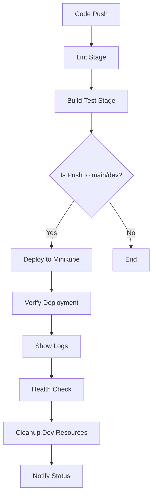

# CI Pipeline - Minikube Deployment Guide

## 🚀 Overview

This guide explains how to set up and use the CI pipeline that automatically deploys your Semgrep security scanning application to Minikube. The pipeline includes multiple stages: lint, build-test, deploy, and cleanup.

## 📋 Prerequisites

### Required Tools
- **Docker**: For running Minikube and containers
- **Minikube**: For local Kubernetes cluster
- **kubectl**: For Kubernetes cluster management
- **Helm**: For deploying Kubernetes applications
- **GitHub Actions**: For CI/CD pipeline execution

### GitHub Secrets Setup
You need to configure the following secrets in your GitHub repository:

1. Go to your repository → **Settings** → **Secrets and variables** → **Actions**
2. Add these secrets:
   - `SEMGREP_TOKEN_STAGING`: Your Semgrep token for staging environment
   - `SEMGREP_TOKEN_PROD`: Your Semgrep token for production environment

## 🔧 Pipeline Stages

### 1. Lint Stage
- **Purpose**: Validates YAML files and Helm charts
- **Runs on**: Ubuntu latest
- **Actions**:
  - Validates all YAML files for syntax
  - Lints Helm charts
  - Checks required file structure

### 2. Build-Test Stage
- **Purpose**: Runs tests and validates configurations
- **Runs on**: Ubuntu latest
- **Actions**:
  - Installs Python dependencies
  - Runs configuration tests
  - Validates Kubernetes manifests

### 3. Deploy Stage
- **Purpose**: Deploys to Minikube cluster
- **Runs on**: Self-hosted runner
- **Actions**:
  - Starts Minikube cluster
  - Creates namespace
  - Deploys Semgrep job
  - Verifies deployment
  - Shows logs and health status

### 4. Cleanup Stage
- **Purpose**: Cleans up resources (dev environment only)
- **Runs on**: Self-hosted runner
- **Actions**:
  - Removes completed jobs
  - Frees up resources

## 🎯 Usage

### Automatic Triggers

The pipeline automatically runs on:
- **Push to main branch**: Deploys to dev environment
- **Push to dev branch**: Deploys to dev environment
- **Push to feature branches**: Runs lint and build-test only
- **Pull requests**: Runs lint and build-test only

### Manual Triggers

1. Go to **Actions** tab in GitHub
2. Select **CI Pipeline - Minikube Deployment** workflow
3. Click **Run workflow**
4. Choose environment: `dev`, `staging`, or `prod`
5. Click **Run workflow**

## 📁 File Structure

```
gitops-semgrep/
├── .github/
│   └── workflows/
│       ├── ci-pipeline.yml          # Main CI pipeline
│       └── scan-semgrep.yml         # Existing Semgrep workflow
├── environments/
│   ├── dev/values.yaml              # Dev environment config
│   ├── staging/values.yaml          # Staging environment config
│   └── prod/values.yaml             # Production environment config
├── k8s-jobs/
│   ├── Chart.yaml                   # Helm chart metadata
│   └── templates/
│       └── semgrep-job.yaml         # Kubernetes job template
└── rules/                           # Semgrep security rules
    ├── frontend/
    ├── backend/
    └── shared/
```

## 🔄 Pipeline Flow



## 🛠️ Configuration

### Environment-Specific Values

Each environment has its own `values.yaml` file:

- **dev/values.yaml**: Uses hardcoded token for local development
- **staging/values.yaml**: Token injected from `SEMGREP_TOKEN_STAGING` secret
- **prod/values.yaml**: Token injected from `SEMGREP_TOKEN_PROD` secret

### Resource Configuration

| Environment | CPU Limits | Memory Limits | CPU Requests | Memory Requests |
|-------------|------------|---------------|--------------|-----------------|
| Dev         | 1 CPU      | 2Gi           | 500m         | 1Gi             |
| Staging     | 2 CPU      | 4Gi           | 1 CPU        | 2Gi             |
| Production  | 4 CPU      | 8Gi           | 2 CPU        | 4Gi             |

## 🔍 Monitoring and Debugging

### Check Pipeline Status
```bash
# View pipeline runs
kubectl get jobs -n semgrep-{env}

# View detailed logs
kubectl logs job/semgrep-scan-once -n semgrep-{env} --all-containers=true

# Check pod status
kubectl get pods -n semgrep-{env}
```

### Debug Commands
```bash
# Check Minikube status
minikube status

# Verify kubectl context
kubectl config current-context

# Check Helm releases
helm list -n semgrep-{env}

# Describe job for detailed info
kubectl describe job semgrep-scan-once -n semgrep-{env}
```

## 🚨 Troubleshooting

### Common Issues

1. **Minikube not starting**
   - Check Docker daemon is running
   - Verify system resources (4 CPU, 8GB RAM minimum)
   - Run: `minikube delete && minikube start --cpus=4 --memory=8192`

2. **Pipeline fails on lint stage**
   - Check YAML syntax in all files
   - Verify Helm chart structure
   - Ensure required files exist

3. **Deployment fails**
   - Check namespace creation
   - Verify Helm chart syntax
   - Check resource limits

4. **Job doesn't complete**
   - Check pod logs for errors
   - Verify Semgrep token is valid
   - Check resource constraints

### Debug Steps

1. **Check Minikube Status**
   ```bash
   minikube status
   kubectl cluster-info
   ```

2. **Verify Namespace**
   ```bash
   kubectl get ns semgrep-{env}
   kubectl get all -n semgrep-{env}
   ```

3. **Check Job Status**
   ```bash
   kubectl get jobs -n semgrep-{env}
   kubectl describe job semgrep-scan-once -n semgrep-{env}
   ```

4. **View Logs**
   ```bash
   kubectl logs job/semgrep-scan-once -n semgrep-{env} --all-containers=true
   ```

## 🔐 Security Considerations

### Token Management
- **Dev**: Uses dummy token from values.yaml (safe for local testing)
- **Staging/Prod**: Uses secure tokens from GitHub Secrets
- Tokens are never exposed in logs or configuration files

### Access Control
- Pipeline runs on self-hosted runner for security
- Namespace isolation per environment
- Resource limits prevent resource exhaustion

## 📈 Best Practices

1. **Always test changes in dev first**
2. **Use feature branches for development**
3. **Monitor resource usage**
4. **Keep secrets secure**
5. **Regular cleanup of completed jobs**
6. **Monitor pipeline execution times**

## 🎉 Success Indicators

Your CI pipeline is working correctly when you see:
- ✅ All stages complete successfully
- ✅ Minikube cluster starts properly
- ✅ Namespace is created
- ✅ Semgrep job deploys successfully
- ✅ Job completes without errors
- ✅ Logs show successful scan results

## 📞 Support

If you encounter issues:
1. Check the GitHub Actions logs
2. Review the troubleshooting section
3. Verify all prerequisites are met
4. Ensure GitHub Secrets are properly configured

---

**Note**: This pipeline is designed for development and testing environments. For production deployments, consider using a more robust Kubernetes cluster and additional security measures. 